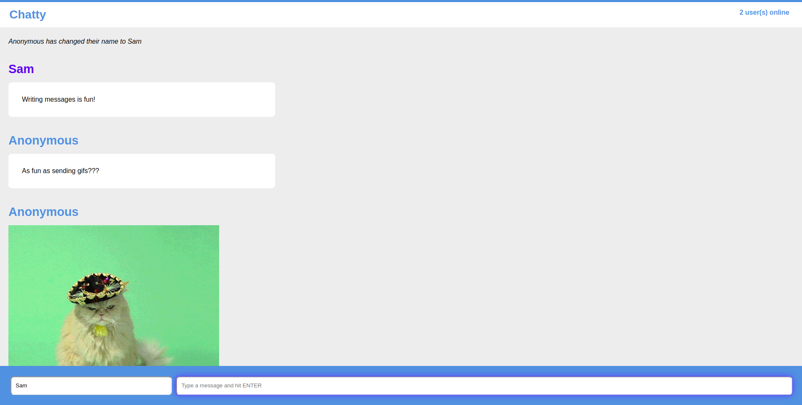

Chatty App
=====================

A minimal chat room application with some treats.

### Functionality

Chatty App makes use of web sockets to let users chat with each other in _real time_. Each user may select a user name for themselves or remain anonymous. The app also includes extra features to enhance the conversation:

* Images can be sent by simply including an image link in it's own message.
* To send a random GIF from Giphy, write `/giphy [text]`. You must have a giphy API key if you're running the chatty server locally (see below)
* To become the **HULK** set your user name to `HULK`.
* Users have colours randomly assigned to their names.

### Usage

1. Clone or download the repo.
2. Run `npm install` in the project directory as well as in /chatty-server.
3. Start the chatty server using `node server.js`.
4. Start the client server using `npm start` in the directory containing chatty app.
5. Open [http://0.0.0.0:8080](http://0.0.0.0:8080).

#### To use /giphy locally

1. Create an app with [Giphy](https://developers.giphy.com/dashboard/?create=true).
2. Create a .env file in the chatty-server/ folder.
3. Add a new environment variable `GIPHY_API_KEY` and give it the Giphy API key as a value.

### Dependencies

* React
* Webpack
* [babel-loader](https://github.com/babel/babel-loader)
* [webpack-dev-server](https://github.com/webpack/webpack-dev-server)
* Express
* [uuid](https://github.com/kelektiv/node-uuid)
* [ws](https://github.com/websockets/ws)
